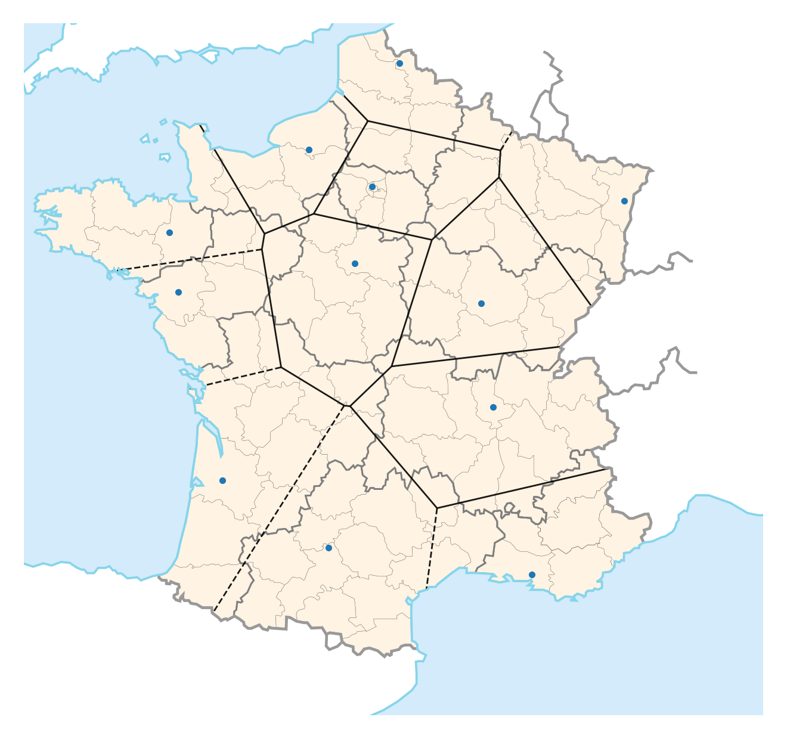
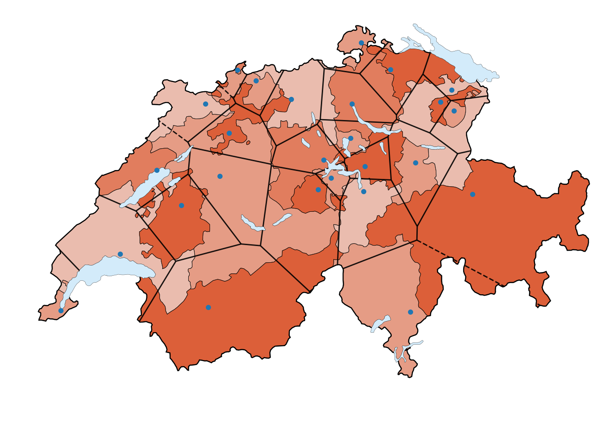

# VoronoiMap

This python project create a map adding a voronoi diagram from certain locations. This allow to check the "correctness" of capital locations from a distance point of view. It allows to obtain this kind of figures :

  

## Dependencies

 This project use regular python librairies : [matplotlib](https://matplotlib.org/), [numpy](https://numpy.org/) and [pandas](https://pandas.pydata.org/). 
 It also use [scipy](https://www.scipy.org/) for computing the voronoi diagram and [svgpathtools](https://pypi.org/project/svgpathtools/) to extract svg modules.

 The different files are:
 * `Main.py`: Main file containing the full pipeline and with all files inputs that need to be modified
 * `ReadSvgPath.py`: custom file extracting svg path and attributes and plotting them as matplotlib patches
 * `svgpath2mpl.py`: File under BSD licence parsing a svg path into a matplotlib patch object.

## Limitations

 Svg maps and locations should be find externally. Wikipedia has a lot of different maps in svg format. Locations could be manually extracted from the svg file of found using other method in lat long format. If locations are in lat long format a custom scaling need to be added modified to the script.

 A top layer can be added to remove infinite voronoi lines, however this layer need to be made externally. I recommend using inkscape and removing all inside object from the svg map and adding a white rectangle on the exterior.

## How to used

* Create/download all the needed files : A svg map, A csv locations and optionally a svg top layer.
* Change the begining of the file `Main.py` with all the names and properties you need.
* run the file

## Licence

This software is distributed under the MIT license. Enjoy!
